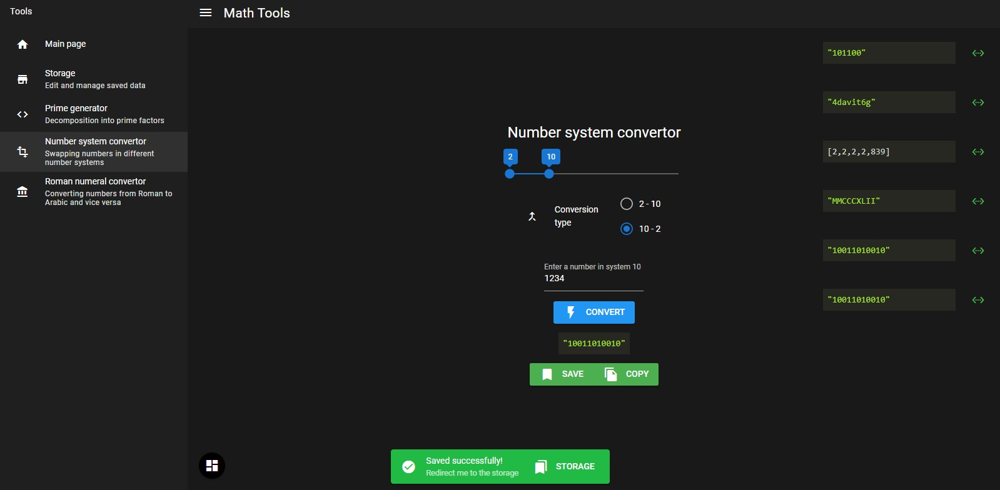

# Math Tools (math-tools)

Webpage for math students, Progressive Web App (PWA) made with Quasar Framework!



## Stack

- Quasar Framework
- Typescript
- Vue (Class Based API)
- Vuex
- i18n
- highlight.js
- vue-clipboard2
- vuedraggable

## Pre-reqs

- Install `yarn` [https://yarnpkg.com/](https://yarnpkg.com/)
- Install `mkcert` [https://github.com/FiloSottile/mkcert](https://github.com/FiloSottile/mkcert) (only required for dev server)

## Install

### 1. Clone the repository

```bash
git clone https://github.com/akcyp/math-tools
mkdir math-tools
```

### 2. Install dependencies

```bash
yarn global add @quasar/cli
yarn install
```

### 3a. Build and run pwa

```bash
quasar build -m pwa
```

```bash
quasar serve --history --https dist/pwa
```

### 3b. Run development server

- Install https certificates

```bash
mkdir certificates
cd certificates
mkcert -install
mkcert localhost
cd ..
```

- Run dev server

```bash
quasar dev -m pwa
```
